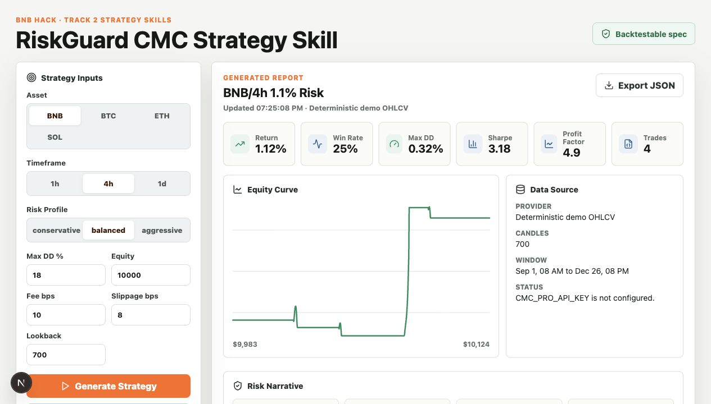
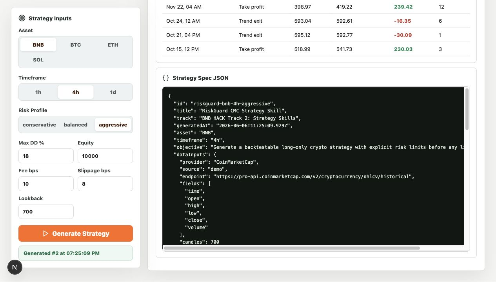

# RiskGuard CMC Strategy Skill

RiskGuard is a Track 2 Strategy Skills demo for BNB HACK. It turns market context into a backtestable crypto strategy specification with deterministic risk controls, no-lookahead backtesting, fees, slippage, and an explainable report.

## Why This Project

Track 2 asks for a strategy skill, not a live trading agent. RiskGuard focuses on the pre-trade research layer: a user picks an asset, timeframe, and risk profile, then receives an auditable JSON strategy spec plus a backtest report that can be reviewed before any execution system is connected.

## What It Does

- Generates a JSON strategy specification for a selected asset, timeframe, and risk profile.
- Uses CoinMarketCap market data when `CMC_PRO_API_KEY` is configured.
- Falls back to deterministic demo OHLCV data so judges can run the project without secrets.
- Backtests with entry, exit, stop loss, take profit, position sizing, fees, slippage, max drawdown, Sharpe ratio, profit factor, and equity curve.
- Presents a compact dashboard for strategy review and BUIDL demo recording.
- Includes a CMC-style skill file at `skills/riskguard-strategy-skill/SKILL.md`.

## Strategy Controls

- Trend: EMA(13) above EMA(34)
- Momentum: RSI range by risk profile
- Liquidity: volume filter against SMA(20)
- Stop loss: ATR-based stop
- Take profit: R-multiple target
- Position sizing: risk budget plus fees and stop slippage
- Validation: no-lookahead entry/exit timing, drawdown gate, trade log, equity curve

## Local Setup

```bash
npm install
npm run dev
```

Open `http://localhost:3000`.

Optional CoinMarketCap API key:

```bash
cp .env.example .env.local
# Add your key:
# CMC_PRO_API_KEY=...
```

## Hackathon Track

Target track: **Track 2: Strategy Skills**.

Deliverable: a backtestable strategy spec, not a live trading agent. RiskGuard focuses on generating an auditable strategy plan that can be tested before any deployment.

## Validation

```bash
npm run typecheck
npm run lint
npm run backtest
npm run build
```

Default smoke result uses deterministic BNB/4h demo data and checks that the backtest produces at least three trades and a positive demo return.

## Screenshots

Balanced strategy report:



Aggressive strategy report:


Exportable JSON strategy spec:



## API

```bash
curl -X POST http://localhost:3000/api/strategy \
  -H "Content-Type: application/json" \
  -d '{"asset":"BNB","timeframe":"4h","riskProfile":"balanced","maxDrawdownPct":18,"startingEquity":10000,"feeBps":10,"slippageBps":8,"lookbackBars":700}'
```

## Submission Notes

See `docs/buidl-submission.md` for the DoraHacks BUIDL draft, prize targets, and demo script.

Submission links:

- GitHub: https://github.com/G-Oct15-Lib/riskguard-cmc-strategy-skill
- Live demo: https://riskguard-cmc-strategy-skill.vercel.app
- Demo video: https://github.com/G-Oct15-Lib/riskguard-cmc-strategy-skill/releases/download/demo-v1/riskguard-demo.mp4

Additional prep docs:

- `docs/dorahacks-form.md`
- `docs/demo-video-script.md`
- `docs/deployment.md`
- `docs/assets/`
