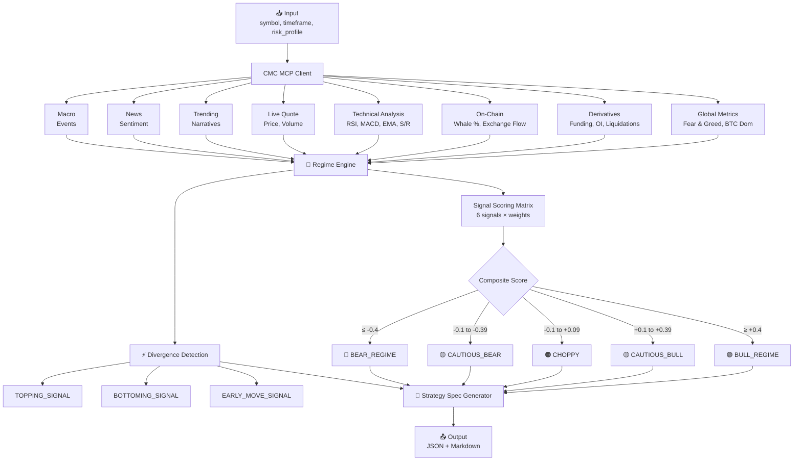

# Vantage — CMC AI Agent Skill


A CoinMarketCap AI Agent Skill that detects crypto market regime transitions using three signal layers — **derivatives positioning**, **on-chain flow**, and **market sentiment** — and outputs fully backtestable trading strategy specifications.

[](https://mcp.coinmarketcap.com)
[](https://www.typescriptlang.org/)
[](./LICENSE)

---

##  What It Does

Vantage is a **strategy generation skill**. It:

1. **Reads** live market data from 8+ CoinMarketCap MCP tools
2. **Detects** market regime transitions using a weighted composite scoring matrix
3. **Identifies** signal divergences (topping, bottoming, early moves)
4. **Outputs** a complete, backtestable trading strategy specification

```
Input: { symbol: "BNB", timeframe: "1d", risk_profile: "moderate" }
  ↓
Output: Full strategy spec with exact entry/exit rules, position sizing,
        invalidation conditions, and backtest parameters
```

---

##  Architecture



---

##  Signal Layers

| Layer | Signal | Weight | Source |
|-------|--------|--------|--------|
| **Derivatives** | Leverage Sentiment | 25% | Funding rates, OI, liquidation ratio |
| **On-Chain** | Smart Money Score | 25% | Whale %, exchange net flow |
| **Technical** | Technical Bias | 20% | RSI, MACD, EMA50, support/resistance |
| **Sentiment** | Narrative Heat | 10% | Trending sectors & narratives |
| **Sentiment** | Fear & Greed | 10% | CMC Fear & Greed Index |
| **Sentiment** | News Sentiment | 10% | Latest news headline analysis |

### Divergence Detection (Key Differentiator)

| Condition | Signal | Impact |
|-----------|--------|--------|
| Leverage=GREED + SmartMoney=DISTRIBUTION | **TOPPING_SIGNAL** | Conviction -2 |
| Leverage=FEAR + SmartMoney=ACCUMULATION | **BOTTOMING_SIGNAL** | Conviction +2 |
| Technical=BULLISH + Narrative=COLD | **EARLY_MOVE_SIGNAL** | Conviction +1 |

---

##  Quick Start

### Prerequisites

- Node.js 18+
- Python 3.8+ (for backtest runner)
- CoinMarketCap API Key

### Installation

```bash
git clone https://github.com/your-team/regimeshift-skill.git
cd regimeshift-skill
npm install
cp .env.example .env
# Edit .env with your CMC_API_KEY
```

### Run Demo

```bash
# One-command demo
./demo/demo.sh

# Custom parameters
./demo/demo.sh BNB 1d moderate 100000
./demo/demo.sh BTC 4h conservative 50000
./demo/demo.sh ETH 1w aggressive 200000
```

### Run Directly

```bash
npx tsx src/index.ts \
  --symbol BNB \
  --timeframe 1d \
  --risk-profile moderate \
  --portfolio-size 100000 \
  --format both
```

### Run Backtest

```bash
python3 backtest/backtest-runner.py examples/bnb-1d-output.json
python3 backtest/backtest-runner.py examples/btc-4h-output.json --output results.csv
```

---

##  Project Structure

```
regimeshift-skill/
├── README.md               # This file
├── skill.json              # CMC Skills Marketplace manifest
├── skill.md                # LLM system prompt (human readable)
├── package.json            # Node.js dependencies
├── tsconfig.json           # TypeScript configuration
├── .env                    # Environment variables (not committed)
├── src/
│   ├── index.ts            # Skill entry point & orchestrator
│   ├── mcp-client.ts       # CMC MCP connection + 8 tool wrappers
│   ├── regime-engine.ts    # Scoring matrix + divergence logic
│   ├── strategy-spec.ts    # Spec generator + output formatter
│   └── types.ts            # TypeScript types for all data models
├── examples/
│   ├── bnb-1d-output.json  # BNB/1d/moderate → CAUTIOUS_BULL
│   ├── btc-4h-output.json  # BTC/4h/conservative → BULL_REGIME + divergence
│   └── eth-1w-output.json  # ETH/1w/aggressive → CHOPPY (NO_TRADE)
├── backtest/
│   ├── backtest-runner.py  # Python backtest replay engine
│   └── sample-results.csv  # Pre-run results for judging
└── demo/
    └── demo.sh             # One-command demo script
```

---

## 🔧 CMC MCP Tools Used

This skill leverages **8 primary CMC MCP tools** for data collection:

| # | Tool | Purpose |
|---|------|---------|
| 1 | `get_global_market_metrics` | Fear & Greed, BTC dominance, market cap |
| 2 | `get_derivatives_data` | Funding rates, open interest, liquidations |
| 3 | `get_on_chain_metrics` | Whale distribution, exchange flows |
| 4 | `get_technical_analysis` | RSI, MACD, EMA, support/resistance, Fibonacci |
| 5 | `get_live_quote` | Real-time price, volume, market cap |
| 6 | `get_trending_narratives` | Hot sectors and narrative detection |
| 7 | `get_latest_news` | News sentiment and catalyst detection |
| 8 | `get_macro_events` | Upcoming macro risk events |

Additional tools referenced in skill.json:
- `get_market_cap_technical_analysis`
- `get_community_sentiment`
- `get_crypto_info`
- `search_cryptocurrencies`

---

## 📋 Output Schema

Every strategy spec includes:

- **Strategy Metadata**: Name, timestamp, asset, timeframe, regime, conviction score
- **Entry Rules**: Exact primary trigger + confirmation conditions + price zone
- **Exit Rules**: TP1, TP2, stop loss, trailing stop, time stop
- **Position Sizing**: Base allocation, conviction multiplier, final %, max risk
- **Invalidation**: Specific conditions that nullify the strategy
- **Backtest Parameters**: Lookback, frequency, benchmark, slippage, costs
- **Risk Flags**: Macro events and extreme market conditions
- **Signal Breakdown**: Complete table of all 6 signals with raw values and scores
- **Divergences**: Detected topping/bottoming/early move signals

---

##  Example Outputs

### BNB / 1d / Moderate → CAUTIOUS_BULL (Score: +0.35)
```
Entry: RSI crosses above 45 AND price reclaims EMA50 ($685.20)
TP1: +6.25% | TP2: $748.30 resistance | SL: -1.5%
Allocation: 6.25% of portfolio
```

### BTC / 4h / Conservative → BULL_REGIME with BOTTOMING_SIGNAL
```
Entry: RSI crosses above 35 from oversold, smart money accumulation
TP1: +3.0% | TP2: $103,800 resistance | SL: -1.5%
Conviction: 8/10 (boosted by divergence)
```

### ETH / 1w / Aggressive → CHOPPY (NO_TRADE)
```
Entry: No trade. Wait for regime clarity.
All signals neutral — composite score: +0.05
```

---

##  License

MIT License — see [LICENSE](./LICENSE) for details.

---
